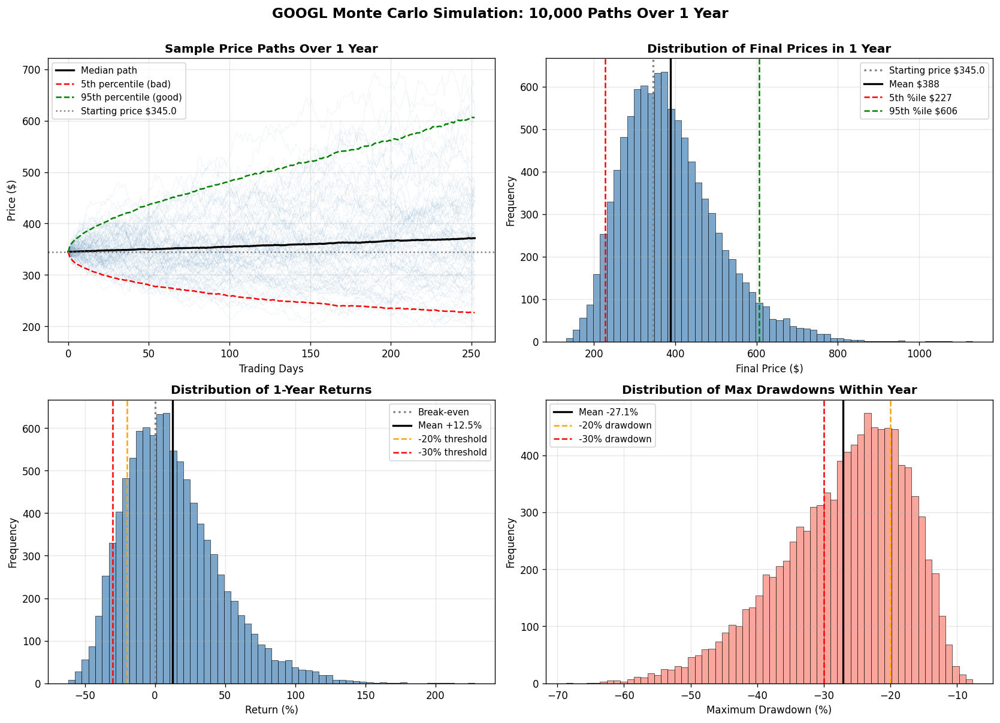

# Alphabet (GOOGL) — Equity Investment Analysis

A fundamental investment analysis of Alphabet Inc. (GOOGL), backed by a
Monte Carlo simulation that models the range of possible one-year price
outcomes. The written analysis works from public SEC filings and the Q1 2026
earnings print; the simulation translates the resulting return/risk view into
probabilities.

> Personal research project for educational purposes — not investment advice.

---

## Contents

| File | What it is |
|---|---|
| [`analysis/GOOGL_Investment_Analysis.md`](analysis/GOOGL_Investment_Analysis.md) | Full written analysis: thesis, "why now", what the market is missing, evidence, valuation, and risks (renders inline on GitHub). |
| [`analysis/GOOGL_Investment_Memo.pdf`](analysis/GOOGL_Investment_Memo.pdf) | Polished investment memo (PDF). |
| [`analysis/GOOGL_Substack_Writeup.pdf`](analysis/GOOGL_Substack_Writeup.pdf) | Long-form public write-up of the thesis. |
| [`src/monte_carlo.py`](src/monte_carlo.py) | The Monte Carlo simulation. |

## The fundamental view (summary)

- **Thesis:** Long GOOGL at ~$345 (~23x forward). Q1 2026 confirms Google Cloud
  is converting a large backlog at expanding margins while Search continues to
  grow ~19% YoY despite the full AI Overviews rollout.
- **Approach:** valuation from SEC filings — CAGR, valuation multiples, and
  segment margins — combined with a risk view expressed through simulation.

See the analysis documents above for the full reasoning and evidence.

## The Monte Carlo simulation

Models GOOGL's price over one year (252 trading days) using **geometric
Brownian motion** across **10,000 simulated paths**, then summarises the
distribution of outcomes.

**Inputs (assumptions, editable at the top of `monte_carlo.py`):**

| Parameter | Value | Basis |
|---|---|---|
| Starting price (`S0`) | $345.00 | Late-April 2026, post-Q1 |
| Expected annual return (`MU`) | 12% | ~4.3% earnings yield + ~14% EPS growth − multiple compression |
| Annual volatility (`SIGMA`) | 30% | GOOGL 3-year historical |
| Horizon | 1 year (252 days) | |
| Simulations | 10,000 | |

**Outputs:** percentile price/return outcomes, probability of profit and of
hitting gain/loss thresholds, maximum-drawdown distribution, and dollar
outcomes for a $10,000 position — plus a 4-panel chart.



## How to run

```bash
python3 -m venv .venv
source .venv/bin/activate
pip install -r requirements.txt
python src/monte_carlo.py
```

The chart is written to `outputs/googl_monte_carlo.png` and the statistics
print to the console. A fixed random seed makes results reproducible.

## Tech stack

- **Python** · **NumPy** (vectorised GBM simulation) · **Matplotlib** (charts)

## Method notes

- Geometric Brownian motion with the Itô correction term
  (`(μ − ½σ²)·dt + σ·√dt·Z`).
- Drawdowns computed vectorised across all paths via a running maximum.
- GBM assumes constant drift/volatility and log-normal returns — a deliberate
  simplification; the assumptions, not the model, carry the analytical weight.
